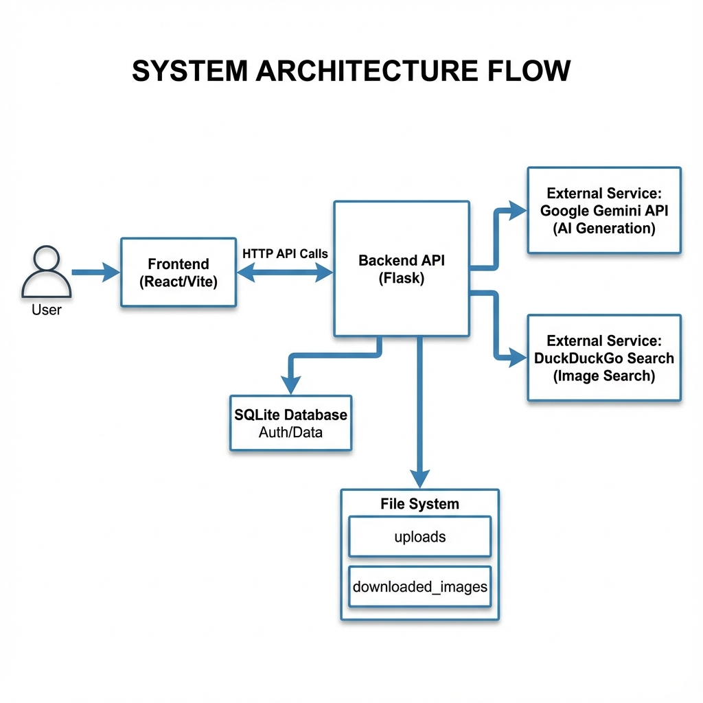
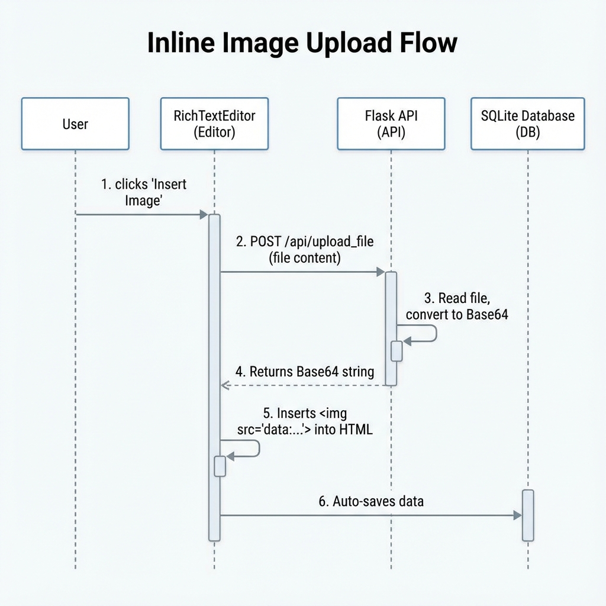
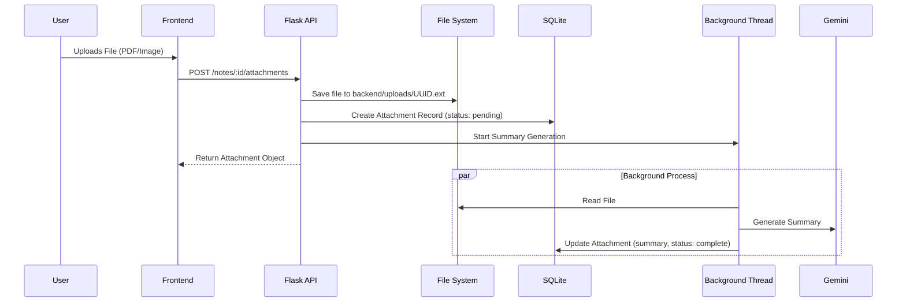
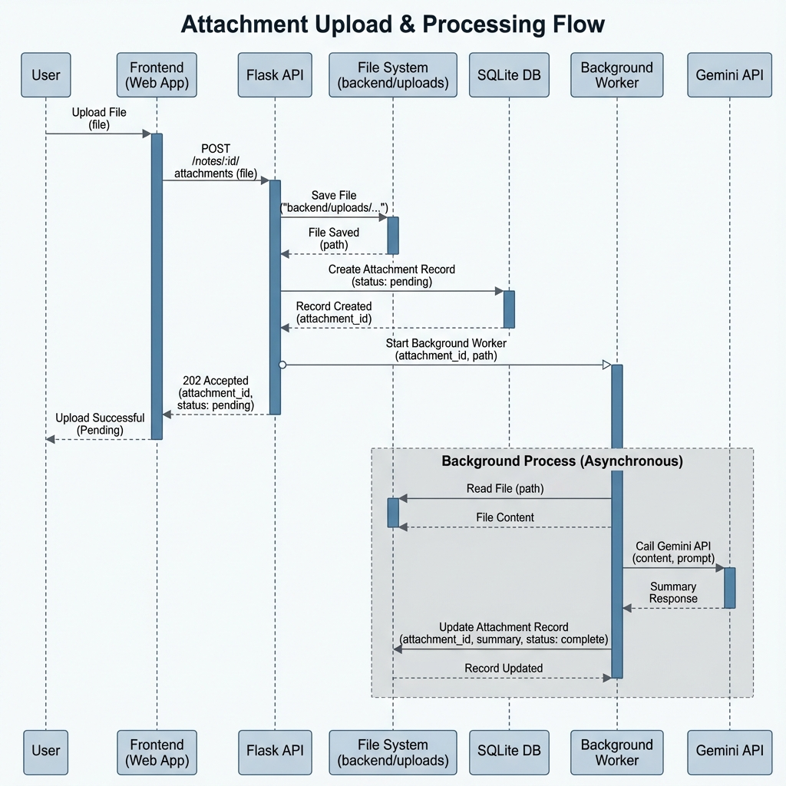
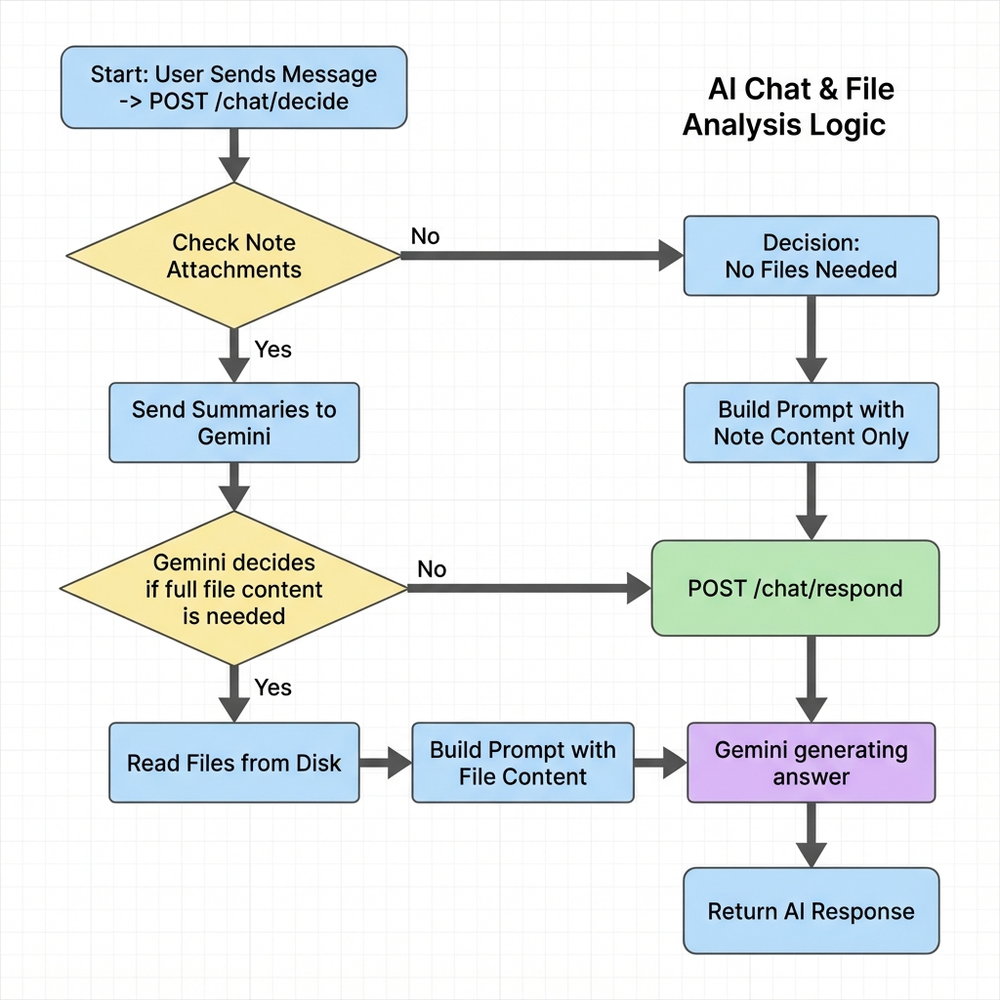
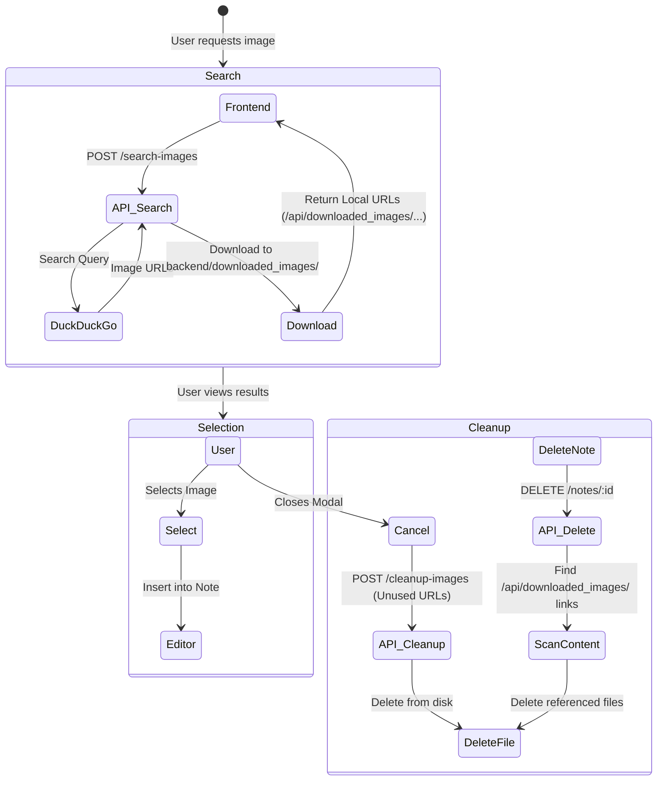
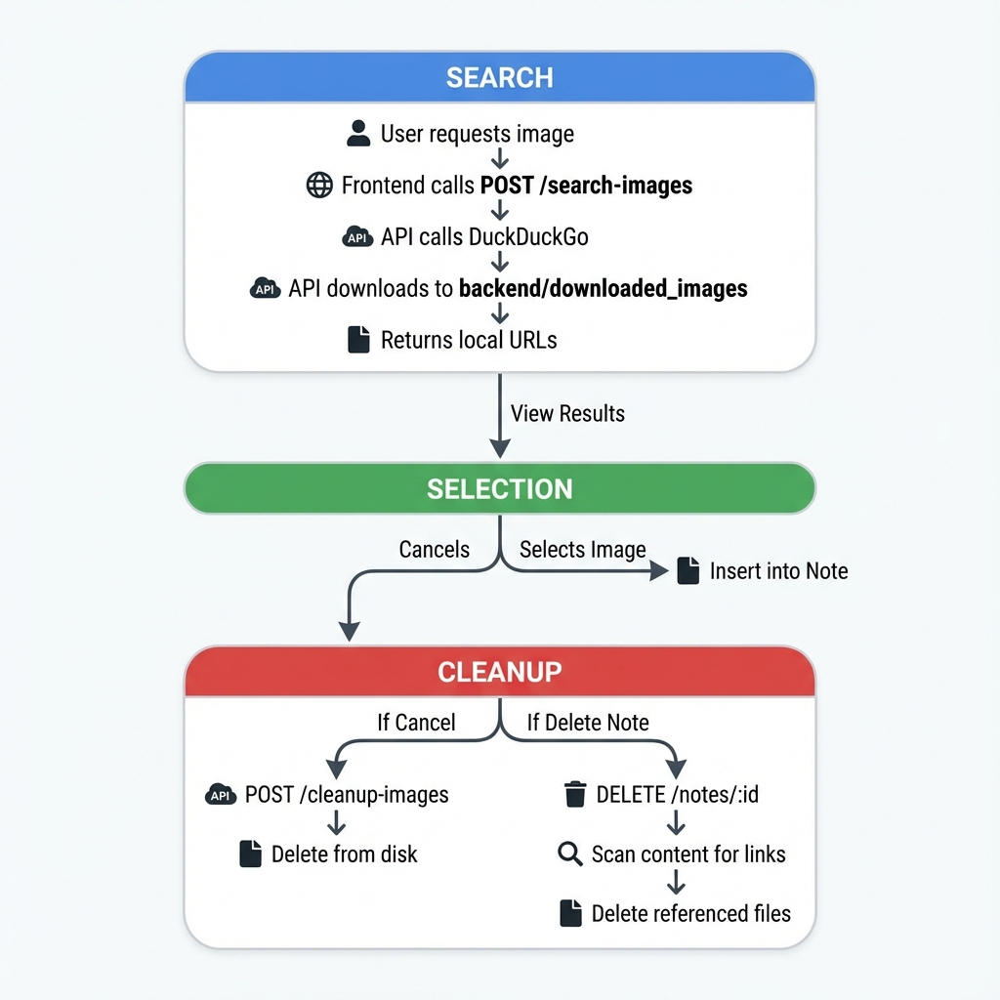

# Technical Flow Diagrams

This document outlines the technical architecture and process flows of the AI Notes Maker application.

## 1. High-Level System Architecture

Overview of how the Frontend, Backend, Database, and External Services interact.

```mermaid
graph TD
    User[User] -->|Interacts| FE[Frontend (React/Vite)]
    FE -->|HTTP API Calls| API[Backend API (Flask)]
    
    subgraph Backend
        API -->|Auth/Data| DB[(SQLite Database)]
        API -->|File I/O| FS[File System]
        FS -->|Uploads| UploadsDir[backend/uploads/]
        FS -->|Downloads| DownloadsDir[backend/downloaded_images/]
    end
    
    subgraph External Services
        API -->|AI Generation| Gemini[Google Gemini API]
        API -->|Image Search| DDG[DuckDuckGo Search]
    end
```




## 2. Image Handling Flows

There are two distinct ways images are handled in the application: **Inline Images** (pasted/inserted) and **Attachments** (files).

### A. Inline Image Upload (Base64)
Images inserted directly into the editor are stored as Base64 strings within the HTML content.

```mermaid
sequenceDiagram
    participant User
    participant Editor as RichTextEditor
    participant API as Flask API (/upload_file)
    participant DB as SQLite (Note Content)

    User->>Editor: Clicks "Insert Image" or Pastes
    Editor->>API: POST /api/upload_file (File)
    Note over API: Reads file into memory
    Note over API: Converts to Base64 string
    API-->>Editor: Returns { "image": "data:image/png;base64..." }
    Editor->>Editor: Inserts  into HTML
    Editor->>DB: Auto-save (PUT /notes/:id)
    Note over DB: Saves entire HTML with Base64 image
```




### B. Attachment Upload (File System)
Files uploaded via the "Attach File" button are saved to disk and referenced in the database.






## 3. AI Chat & File Analysis Flow

How the system decides whether to read local files before answering a user question.

```mermaid
flowchart TD
    Start[User Sends Message] --> DecideEndpoint{POST /chat/decide}
    
    subgraph "Phase 1: Decision"
        DecideEndpoint --> CheckAtts[Check Note Attachments]
        CheckAtts -->|Has Attachments| SendSummaries[Send Summaries + User Query to Gemini]
        CheckAtts -->|No Attachments| NoFiles[Decision: No Files Needed]
        SendSummaries --> GeminiDecide[Gemini: "Do I need full file content?"]
        GeminiDecide -->|Yes| ReturnFiles[Return: need_files=true, file_indices=[...]]
        GeminiDecide -->|No| ReturnNoFiles[Return: need_files=false]
    end
    
    ReturnFiles --> RespondEndpoint{POST /chat/respond}
    ReturnNoFiles --> RespondEndpoint
    NoFiles --> RespondEndpoint
    
    subgraph "Phase 2: Response"
        RespondEndpoint --> ReadFiles{Need Files?}
        ReadFiles -->|Yes| DiskRead[Read Files from backend/uploads/]
        ReadFiles -->|No| SkipRead[Skip File Reading]
        
        DiskRead --> BuildContext[Build Prompt with File Content]
        SkipRead --> BuildContext[Build Prompt with Note Content Only]
        
        BuildContext --> GeminiGen[Gemini: Generate Answer]
        GeminiGen --> Response[Return AI Response]
    end
```




## 4. Image Search & Cleanup Process

How images are searched, downloaded, and cleaned up to prevent storage bloat.





